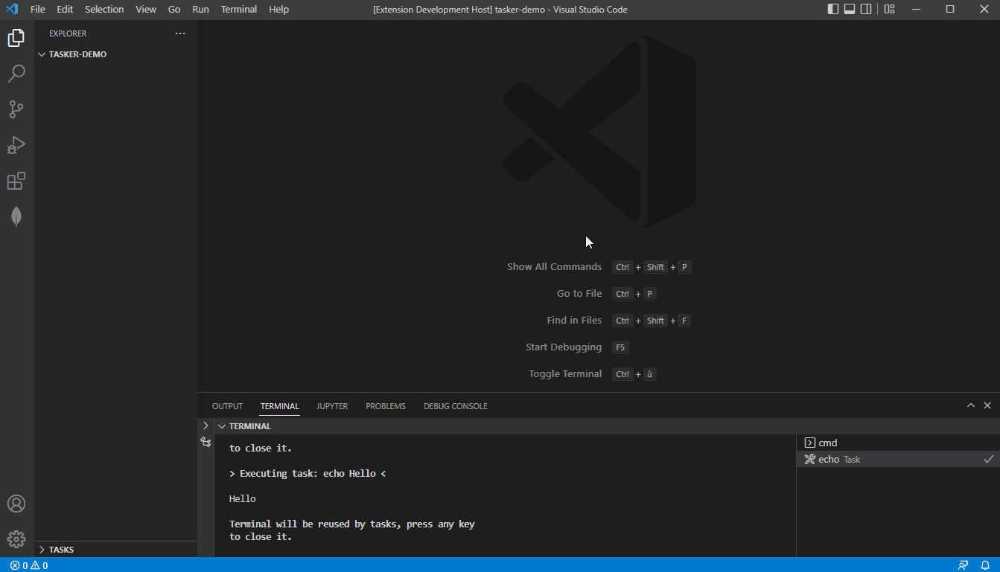

# Tasker README

Tasker is a simple extension that provides an easy way to execute tasks via the explorer view.

## Features

Demo of basic tasker utilisation:

## Requirements

No requirements

## Extension Settings

No settings

## Known Issues

## Release Notes

### 0.0.1

Initial release of tasker:
-   Explore your tasks in the explorer
-   Refresh view on tasks.json changes